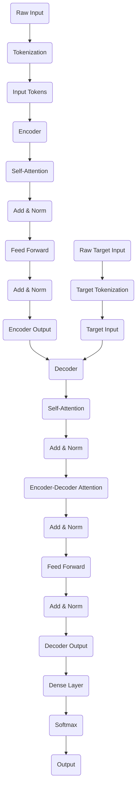
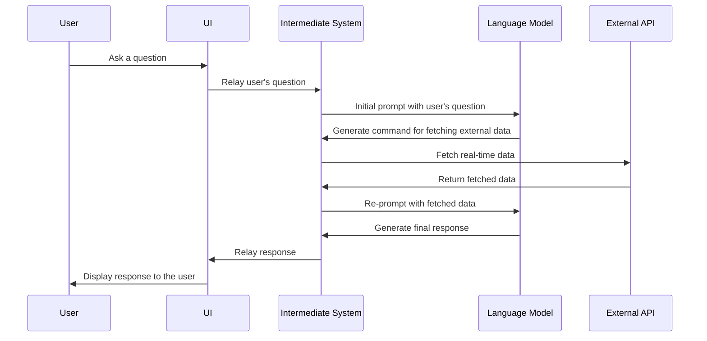

# AI 🔮 ✨

Prompt Engineering Notes | GPT-3 | GPT-4 | LLMs | Transformer Architecture

## Resources

- [Huggingface Course](https://huggingface.co/course)
- [HF - Byte-Pair Encoding tokenization](https://huggingface.co/course/chapter6/5?fw=pt)
- [Wiki - Byte-Pair Encoding tokenization](https://en.wikipedia.org/wiki/Byte_pair_encoding)

## Projects

- [karpathy/micrograd](https://github.com/karpathy/micrograd)
  - Youtube: [The spelled-out intro to neural networks and backpropagation: building micrograd](https://www.youtube.com/watch?v=VMj-3S1tku0) by [Andrej Karpathy](https://karpathy.ai/zero-to-hero.html)
- [geohot/tinygrad](https://github.com/geohot/tinygrad)

- [jaymody/picoGPT](https://github.com/jaymody/picoGPT)


## GPT-4

- Large language model developed by OpenAI.
- GPT-4 stands for "Generative Pretrained Transformer 4"
- I am an instance of the Transformer architecture.
- The primary purpose is to generate human-like responses by understanding and predicting the context of the input text
- Advanced deep learning model designed for NLP (natural language processing) tasks.
- GPT-4, like its predecessor GPT-3, is based on the Transformer architecture, but it primarily utilizes the **decoder part** of the original Transformer model.
- It **does not** use the **encoder-decoder** structure found in the original *"Attention is All You Need"* paper by Vaswani et al.

### Transformer architecture

The Transformer architecture is quite complex, next is a high-level Mermaid diagram illustrating its main components. Keep in mind that this is a simplified representation of the architecture.



In this diagram, the input flows through the Encoder, which consists of self-attention, add & normalize, and feed-forward layers. The output of the Encoder is then passed to the Decoder, which has similar components, along with an additional Encoder-Decoder attention mechanism. The Decoder output goes through a dense layer and softmax activation to produce the final output.

Please note that this diagram is a simplified overview, and the actual Transformer architecture has multiple layers and more detailed components. For a comprehensive understanding of the Transformer architecture, I recommend referring to the original paper: ["Attention is All You Need"](https://arxiv.org/abs/1706.03762) by Vaswani et al.

In the original Transformer model:

- **Encoder**: processes input sequences and creates contextualized representations, while...
- **Decoder** generates output sequences based on these representations.

Both encoder and decoder consist of **multiple layers** with **self-attention** mechanisms and feed-forward neural networks.

GPT-4, as a **generative** language model, focuses on the **decoder part of the Transformer architecture**.

It consists of:

- Several layers of **self-attention** mechanisms with...
- **Position-wise feed-forward neural networks**  

It has been **trained** using a **unidirectional** (left-to-right) **masked language modeling objective**  which means it learns to predict the next word in a sentence, given the **context** of the previous words.

When generating text, GPT-4 takes an **input prompt** and generates a **sequence of tokens** (words or subwords) **one at a time**  using the trained model's **probabilities** to predict the next token in the sequence.

It does this iteratively until a stopping condition is met:

- Reaching a maximum length or
- Encountering a special end-of-sequence token.

So, while GPT-4 is based on the Transformer architecture, it primarily employs the **decoder component** and does not use the encoder-decoder structure found in the original design.

### Q: Help me understand why you don’t need the encoder?

GPT-4, as a generative language model, **doesn't use the encoder part** of the Transformer architecture because its primary task is to generate text based on a given prompt, rather than translating or mapping an input sequence to an output sequence. The decoder component alone is sufficient for this purpose.

The original Transformer architecture, with its encoder-decoder structure, was designed for **sequence-to-sequence** tasks like machine translation, where the goal is to **map an input** sequence (e.g., a sentence in one language) to an output sequence (e.g., a sentence in another language). In this case, the **encoder captures the contextual information** of the input sequence, while the **decoder generates the output sequence** using this information.

However, for language modeling tasks like GPT-4's, the goal is to **predict the next word in a sequence** given the **context of the previous words**  The **decoder** component of the Transformer architecture is capable of **capturing context and generating text**  making it suitable for this task without the need for an encoder.

In summary, GPT-4 doesn't use the encoder part of the Transformer architecture because it is **designed for generative language modeling tasks**  which can be **accomplished using only the decoder** component. This allows GPT-4 to focus on **predicting and generating text based on the given context,** without the need for an encoder to process an input sequence.

### Q: Help me understand how you respond to a prompt using the decoder. Do you need the previous token to be able to answer the next one or you can **parallelize** the answer?

When GPT-4, or any generative language model based on the Transformer architecture, responds to a prompt using the decoder, it generates the output tokens **sequentially**  predicting **one token at a time**  

The model relies on the **previous tokens** in the sequence to predict the next token, so **the process is inherently sequential** and **cannot be fully parallelized**

### High-level overview of how GPT-4 generates a response using the decoder

1. **Tokentization**

The input prompt is tokenized into a sequence of tokens (words or subwords).

2. **Emeddings**

Each token is embedded with a **continuous vector representation**, and **positional encoding** is added to maintain information about the token's position in the sequence.

3. **Decoding**

The **token embeddings** are fed into the decoder, which consists of **multiple layers** of **self-attention** mechanisms and **feed-forward networks**

4. **Attention**

In each layer, the self-attention mechanism computes **attention scores** between each token and every other token in the sequence, allowing the model to capture **contextual information and dependencies between tokens**

5. **Activation**

The output of the decoder's final layer is passed through a **linear layer** and a **softmax activation** function to produce a **probability distribution** over the vocabulary for the next token.

6. **Selection & Probability**

A token is sampled or selected based on this **probability distribution**  and it's added to the sequence.

7. **Repeat** from **Decoding**

The process repeats from step 3, using the extended sequence as input, until a stopping condition is met (e.g., maximum length, end-of-sequence token, or other criteria).

Final Notes on Parallelization:

Due to the reliance on **previous tokens** and the **sequential nature** of the above process, **GPT-4 *cannot* generate the entire response in parallel**  

However, during **training**  GPT-4 (and other variants of the Transformer architecture) **can benefit from parallelization** in **processing multiple sequences in a batch simultaneously**  

Also, it's worth noting that the **self-attention mechanism within each layer can be parallelized**  as the **attention scores** between all tokens can be **computed simultaneously**.

But the **token generation process remains inherently sequential**

### Q. Say the input prompt has a personal information like my number or email that is not part of the English dictionary, how does it work? if the input is "hello my name is Gaston and my email is gaston@gastonmorixe.com", "hello" is a word in the English dictionary so is that the same as a token? and what do you do with my email? Do yo tokenize it? How are you able to remember it for later?

Great questions! Let's break down how GPT-4 handles a prompt with personal information like an email address.

1. **Tokenization**

When the input prompt contains words or phrases that are not part of the standard English dictionary, such as an email address, the tokenizer will **break them down into smaller chunks called tokens**  

GPT models use **subword tokenizers**  like **Byte-Pair Encoding** (BPE) or **WordPiece**  which can handle out-of-vocabulary words by breaking them into smaller subword units.

In your example, the input prompt is:

```
"hello my name is Gaston and my email is gaston@gastonmorixe.com"
```

The tokenizer will convert this into a sequence of tokens. For instance, the email address `gaston@gastonmorixe.com` might be tokenized into several subword tokens, such as **`gaston`, `@`, `gastonmor`, `ixe`, `.`, and `com`.** The exact tokenization depends on the specific tokenizer and its vocabulary.

2. **Token embeddings**

Each token, whether it's a common English word like "hello" or a **subword** from an email address, will be **mapped to a continuous vector representation, called an embedding**  These embeddings are **learned during the training process** and **capture semantic and syntactic information** about the tokens.

3. **Positional encoding**

To maintain information about **each token's position in the sequence**, positional encoding is added to the token embeddings. This allows the model to **capture the relative ordering of the tokens**  which is crucial for **understanding the context** and **generating coherent responses**

4. **Contextual understanding**

As the decoder processes the sequence of tokens, the **self-attention** mechanism allows it to capture the **relationships and dependencies between tokens**, including the **email address**. This enables the model to "**remember**  the email address and potentially use it in the generated response.

Keep in mind that GPT-4's ability to **remember** and use specific information like an email address depends on various factors, such as the **model size**  the **complexity** of the input prompt, and the **training** data it has seen. While GPT-4 can often generate coherent responses, it's not perfect and may sometimes fail to use or **remember certain details correctly**.

### Q: To be able to create a chat like this conversation, it seems that you somehow remember a big part of the previous  prompts I entered and also your own responses. Is that right? If so, can you help me understand how this works? More importantly my question is, how do you keep track of the past  context of the conversation? and my key question is: every time a new prompt is given to you, do you need to pass and run all the previous conversation to the decoder again?

You are **correct** that, to generate contextually coherent responses in a conversation-like setting, GPT-4 needs to maintain information about the **previous prompts and responses**  The way GPT-4 does this is by **encoding the context of the conversation in the token sequence**  which is processed by the **decoder**

To explain how this works, let's break it down into steps:

1. **Concatenating the conversation**

When you provide a new prompt, the **conversation history** (including your **previous prompts and the model's responses**  is **concatenated with the new prompt** to form **an extended input sequence**

2. **Tokenization**

**The entire input sequence**  including the **conversation history and the new prompt**, is tokenized into a sequence of tokens. This allows the model to process and understand the context of the conversation.

3. **Decoder processing**

The tokenized input sequence is fed into the decoder, which generates a response based on the context captured in the sequence. The **self-attention** mechanism within the decoder allows the model to attend to different parts of the input sequence, capturing the relationships and dependencies between tokens. This helps the model to maintain and use the context of the conversation when generating a response.

4. **Output**

The model generates a response to the new prompt, taking into account the context of the conversation encoded in the input sequence.

To answer your key question: **Yes, every time a new prompt is given, the previous conversation is passed to the decoder again** as part of the input sequence. This allows the model to maintain the context of the conversation and generate coherent, contextually relevant responses.

It is important to note that GPT-4 and similar models have a **maximum context length they can process**  often referred to as the "context window" or "token limit." For instance, GPT-3 has a token limit of 2048 tokens. If a conversation exceeds this limit, the model may lose some context from the earlier parts of the conversation. In such cases, the input sequence needs to be **truncated or otherwise shortened to fit** within the model's context window. This limitation is one of the challenges when using these models for maintaining long-term context in a conversation.

### Q: Why does a "maximum context length" "context window" or "token limit" exist at all in first place? What prevents it to be huge or infinite?  

The "maximum context length," "context window," or "token limit" exists in transformer-based models like GPT due to **several reasons**, mainly related to **computational resources** and **model architecture**  Here are the primary factors that contribute to these limits:

- **Memory constraints**

The memory requirements of transformer models **increase quadratically** with the input sequence length. This is mainly due to the **self-attention** mechanism, which calculates **attention weights** for every token in the input sequence with **respect to every other token**. As the sequence length grows, the memory required to store these weights and intermediate calculations grows rapidly. For practical purposes, these memory constraints limit the context length that can be efficiently processed by the model on available hardware, such as GPUs or TPUs.

- **Computational complexity**

The computational complexity of transformer models also increases with the input sequence length. Longer sequences demand more computation, which leads to increased processing times and higher energy consumption. This can be a concern for real-time applications, where response time is critical, or when running on resource-constrained devices.

- **Model architecture**

Transformer models have a **fixed input size** due to their architecture. They use **positional embeddings** to encode the position of each token in the input sequence, and these **embeddings are pre-computed and learned during training** for a **specific maximum sequence length**. While it's possible to create models with larger context windows, this increases the number of parameters, making the model larger and more computationally demanding.

- **Training data limitations**

During the training process, transformer models are exposed to sequences with limited lengths. If the model is trained with sequences up to a certain length, it may not generalize well to much longer sequences, as it **has not learned the appropriate representations and dependencies for such inputs**

- **Vanishing gradients**

Although the transformer architecture is designed to mitigate the vanishing gradient problem to some extent, **very long input sequences can still suffer from this issue**  As the sequence length increases, the gradients flowing back through the network during training can become very small, leading to slower learning or convergence issues.

In summary, the maximum context length in transformer models like GPT is primarily constrained by **memory requirements**  **computational complexity**  **model architecture**  **training data limitations**  and **vanishing gradients**  

While it's **theoretically possible** to create models with larger or even infinite context lengths, practical considerations related to hardware resources, training data, and model performance make it challenging to achieve in real-world applications.

### Q: Tell me some techniques, theories, ideas you know or come up with a few creative solutions for me to investigate further to improve GPT or the transformer architecture to have the ultimate goal of infinite context lengths

Achieving **infinite context lengths** in **transformer models** is a challenging goal, but there are various techniques and ideas that can help extend or improve the context handling capabilities of these models. Some of these approaches include:

Sparse Transformers: Sparse Transformers use a modified self-attention mechanism that reduces the quadratic complexity of traditional transformers. By attending only to a subset of tokens instead of all token pairs, Sparse Transformers can handle longer sequences with reduced computational and memory requirements.

Reversible layers: Reversible layers, as introduced in the Reformer architecture, allow the model to recover activations during the backward pass without storing them in memory during the forward pass. This reduces memory consumption and enables the processing of longer sequences.

Dilated self-attention: Dilated self-attention mechanisms attend to a subset of tokens in the input sequence with increasing dilation factors at different layers. This allows the model to capture both local and long-range dependencies while reducing computational complexity.

Long-range arena: Long-range arena is a technique that processes long input sequences by treating them as a combination of multiple, overlapping subsequences. The model processes each subsequence independently and combines the results to generate the final output, effectively handling very long sequences without significantly increasing computational complexity.

Hierarchical models: Develop hierarchical architectures where the model processes input at different levels of granularity, such as words, phrases, sentences, or paragraphs. This can help the model focus on relevant information and capture long-range dependencies more efficiently.

Memory-augmented neural networks: Incorporate external memory modules or memory-augmented mechanisms like Neural Turing Machines (NTMs) or Differentiable Neural Computers (DNCs) to store and retrieve information across long sequences.

Adaptive computation: Develop techniques that adapt the amount of computation required for each token, allowing the model to focus more on relevant parts of the input and less on less informative regions. This can help improve the efficiency of handling long sequences.

Curriculum learning: Train models using a curriculum that gradually increases sequence length during training. This can help the model learn to handle longer sequences by first mastering shorter ones.

Combining multiple models: Combine multiple models with different context window sizes or specialized capabilities to process long sequences more efficiently. For example, several models could process different parts of a long sequence in parallel, with a higher-level model integrating the results.

Sequence summarization: Develop techniques to compress or summarize long input sequences effectively, retaining the most crucial information while reducing the length of the sequence. This summarized input can then be fed into the transformer model.

While achieving infinite context lengths in practice remains a challenge, these techniques and ideas can help extend the capabilities of transformer models and enable them to handle longer input sequences more efficiently. Investigating these approaches and combining them in creative ways could lead to significant improvements in the ability of transformers to handle long contexts.

### Q: Picking up on a previous question I had before about privacy where a company is not allowed to send customer data to a 3rd party. Let's say that company wants to explore with an in-house solution fine-tuning a previous model. Which model or models would are available for a company to fine-tune? AFAIK GPT-3 model hasn't been released, but I may be wrong

You're correct that, as of my knowledge cutoff in September 2021, the full GPT-3 model has not been released by OpenAI for public use. However, OpenAI has released smaller versions of GPT-2, which can be fine-tuned for specific tasks in-house. GPT-2 is available in several sizes, making it suitable for various computational resources and requirements.

To fine-tune GPT-2 or other transformer-based models, you can follow these steps:

Obtain a pre-trained model: Download the pre-trained GPT-2 model (or another transformer-based model) that suits your needs. You can obtain the GPT-2 model and its corresponding tokenizer from the Hugging Face Model Hub: <https://huggingface.co/transformers/pretrained_models.html>

Prepare your dataset: Collect and preprocess your in-house dataset to be compatible with the model's input format. This may involve tokenization, creating input-output pairs for supervised learning, and splitting the data into training and validation sets.

Fine-tune the model: Fine-tune the pre-trained model on your dataset using a suitable framework like Hugging Face's Transformers library, TensorFlow, or PyTorch. You will need to select appropriate hyperparameters, such as learning rate, batch size, and number of training epochs.

Evaluate and iterate: Evaluate the fine-tuned model's performance on a validation set or using other relevant metrics. If the performance does not meet your requirements, you may need to adjust the hyperparameters or fine-tuning process and iterate until the desired performance is achieved.

Deploy the model: Once the fine-tuning is complete and the model's performance is satisfactory, deploy the model within your organization's infrastructure for the intended application.

GPT-2 is just one example of a pre-trained model that can be fine-tuned in-house. There are many other transformer-based models available, such as BERT, RoBERTa, and DistilBERT, which can also be fine-tuned to achieve specific tasks while keeping sensitive data within the organization's boundaries. The choice of model depends on factors like the target domain, available resources, and the desired balance between model complexity and performance.

### Can you recommend a transformer-based model that's suitable for a small dataset?

When working with a small dataset, it's often better to use smaller models that are less prone to **overfitting** and have fewer parameters to train. Here are a few transformer-based models suitable for small datasets:

**DistilBERT**  

DistilBERT is a smaller, distilled version of the BERT model. It retains approximately 95% of BERT's performance while reducing the number of parameters by around 40% and being faster to train and use for inference. DistilBERT is a suitable choice for smaller datasets, as it strikes a balance between model size and performance.
GitHub repository: <https://github.com/huggingface/transformers/tree/master/examples/pytorch/language-modeling>

**ALBERT**  

ALBERT (A Lite BERT) is another variant of BERT that uses parameter-reduction techniques like factorized embedding parameterization and cross-layer parameter sharing. These techniques reduce the number of parameters and memory footprint, making ALBERT more suitable for small datasets.
GitHub repository: <https://github.com/google-research/albert>

**Small GPT-2**

OpenAI's GPT-2 model is available in multiple sizes, such as "small" (117M parameters) or even "mini" (125M parameters). These smaller versions of GPT-2 are more suited to smaller datasets, as they have fewer parameters and require less computation for training and inference.
Hugging Face Model Hub: <https://huggingface.co/transformers/pretrained_models.html>

**TinyBERT**  

TinyBERT is another smaller version of BERT, which is developed using a two-stage learning framework that involves teacher-student learning and task-specific fine-tuning. TinyBERT is designed for resource-constrained environments and can be a good choice for small datasets.
GitHub repository: <https://github.com/huawei-noah/Pretrained-Language-Model/tree/main/TinyBERT>

**MobileBERT**  

MobileBERT is a compact version of BERT designed for mobile and edge devices. It has a smaller model size and lower latency, making it suitable for small datasets and resource-constrained environments.
GitHub repository: <https://github.com/google-research/google-research/tree/master/mobilebert>

When working with a small dataset, it's essential to use techniques like **transfer learning** and **fine-tuning** to leverage the pre-training of these models on large-scale data.

Regularization techniques, such as **dropout** or **weight decay**, can also help prevent overfitting when training on small datasets.

Additionally, **data augmentation** techniques can be employed to artificially increase the size of the dataset and improve the model's generalization capabilities.

### Q: Facebook just released LLaMA: A foundational, 65-billion-parameter large language model

As of my knowledge cutoff in September 2021, I don't have any information on LLaMA, the 65-billion-parameter large language model from Facebook. However, if such a model has been released, it would be an important development in the field of natural language processing and AI.

In general, large-scale language models like LLaMA, GPT-3, and BERT provide state-of-the-art performance on various language understanding and generation tasks. These models are typically pre-trained on vast amounts of text data and can be fine-tuned for specific tasks, such as sentiment analysis, machine translation, summarization, and more.

To utilize a model like LLaMA, you would need to:

Access the model: Obtain access to the model, its weights, and associated resources, such as tokenizers and configuration files. This may be available through a platform like the Hugging Face Model Hub or another repository.

Understand the model's capabilities: Familiarize yourself with the model's architecture, capabilities, and limitations. This will help you decide how to best employ the model for your specific use case.

Prepare your dataset: Collect and preprocess your dataset to be compatible with the model's input format, including tokenization and other necessary preprocessing steps.

Fine-tune the model: Fine-tune the pre-trained LLaMA model on your dataset using a suitable framework, such as Hugging Face's Transformers library, TensorFlow, or PyTorch. You will need to select appropriate hyperparameters and fine-tuning strategies to optimize the model's performance on your task.

Evaluate and iterate: Assess the fine-tuned model's performance on a validation set or using other relevant evaluation metrics. You may need to adjust the hyperparameters or fine-tuning process and iterate until the desired performance is achieved.

Deploy the model: Once the fine-tuning is complete and the model's performance is satisfactory, deploy the model within your organization's infrastructure or application.

Please note that working with such large models might require significant computational resources, especially during fine-tuning and inference. Leveraging cloud-based GPUs or TPUs, or using more efficient model variants, can help mitigate these challenges.

### Q: To improve the performance and speed of the output of a conversation-like, is there any part you could optimize? Could you cache a part of any point you mentioned before?

Optimizing the performance and speed of a **conversation-like** setting can be done by employing various strategies. While **caching intermediate results is one approach**  it may not be straightforward to apply given the way **GPT models generate responses based on the input sequence as a whole**  

However, there are alternative methods to improve the performance and speed:

1. **Truncate or compress context**

If the conversation history is very long, you can **truncate**  **compress**  or intelligently **summarize** the context to fit within the model's token limit. This reduces the number of tokens the model has to process, which can **speed up** the response generation.

2. **Lower the model's size**

Using a **smaller version of the model**  with **fewer layers** and **parameters**  can improve the inference speed. However, this may come at the cost of response quality or contextual understanding. It's essential to find a **balance** between **model size and desired performance**

3. **Batching**

Group multiple input sequences together and process them simultaneously to take advantage of parallel processing capabilities of GPUs or TPUs. This can lead to more efficient use of computational resources and faster response times, especially when handling multiple conversations or requests at once.

4. **Reduce response length**: Set a shorter maximum response length, which can reduce the time spent generating tokens for the response. This can be done using parameters such as `max_length` or `temperature` to control the response's length and randomness.

5. **Optimize decoding**: Use faster decoding techniques, such as greedy decoding or nucleus sampling, instead of the slower beam search. These methods may result in slightly lower-quality responses but can offer significant speed improvements.

6. **Hardware acceleration**: Use hardware accelerators like GPUs or TPUs to speed up the inference process further. Deploying the model on optimized infrastructure can offer considerable performance improvements.

7. **Pre-trained conversation models**: Some models are specifically designed for conversation-like tasks and may have built-in mechanisms for handling context more efficiently. Exploring these models may lead to performance improvements.

While caching intermediate results may not be directly applicable in this case, the above strategies can help optimize the performance and speed of conversation-like interactions with GPT-based models. The choice of optimization methods will depend on the specific requirements of your application and the trade-offs you are willing to make between speed, quality, and resource usage.

### Q: I am thinking you may cache the Tokenization and positional embeddings (maybe self-attention results) of the previous conversation and start from there. If this is possible you wouldn't need to tokenize, create the embeddings and calculate self-attention that you're created before. But please, let me know if I am wrong. Maybe this is not possible or not totally possible. I want to understand

Your idea of **caching the tokenization** and **positional embeddings** of the **previous conversation** to improve the efficiency **is interesting**  

However, **caching self-attention results is more challenging**  and I will explain why.

**Caching tokenization** and **positional embeddings** can be helpful in **saving some processing time**  as these **do not change when new tokens are added to the conversation**  When a new prompt is entered, **you can tokenize only the new part**  combine it with the cached tokenization and positional embeddings, and then pass it to the model.

However, **caching self-attention results is more complex** due to the nature of self-attention mechanism. Self-attention allows the model to weigh the importance of different tokens in the input sequence **relative to each other**  When new tokens are added to the conversation, the **attention weights between tokens can change**  **even for the tokens that have already been processed in previous steps**.

In a transformer model, **self-attention is calculated for each layer**  and each layer's output depends on the previous layer's output. When a new prompt is introduced, the self-attention weights and the output for each layer **must be recalculated**  as the **new tokens can affect the attention distribution across the entire input sequence**  Therefore, caching self-attention results from previous steps is not straightforward, as they would have to be **recomputed** when new tokens are added to the input sequence.

In summary, while caching tokenization and positional embeddings can save some processing time, caching self-attention results is more challenging due to the changing attention distribution when new tokens are added to the conversation. To optimize the performance and speed of a conversation-like setting, you may need to explore other strategies, as mentioned in my previous response.

### Q: Let's say a company wants to use a GPT-4 like model to enhance its products and features by adding NLP/AI intelligence.  Later it finds out that to comply with the law the company finds it is not allowed to send the customers' data to a 3rd party like OpenAI. Is this a problem that you see happening? What real or creative solutions do you think can be created to solve this issue?  

**Yes**  this can indeed be a problem for companies that need to comply with strict **data privacy regulations** or have policies against sharing user data with third parties. In such cases, **sending customer data** to external services like OpenAI's GPT-4 **might not be an option**  There are several possible solutions to address this concern:

1. **On-premises deployment**

Deploy a GPT-4-like model on the company's own infrastructure. This allows the company to maintain **full control** over the data and ensure that it never leaves their premises. However, this comes with the trade-off of increased hardware, maintenance, and operational costs.

2. **Fine-tune a smaller model**

Train and fine-tune a smaller GPT-like model that can run on the company's infrastructure with lower computational requirements. While the performance might not be as good as GPT-4, a fine-tuned model **can still offer valuable NLP/AI capabilities for specific tasks**

3. **Data anonymization**

**Anonymize** or **obfuscate** sensitive customer information **before sending it to the external service**  This can involve techniques like data **masking**  **tokenization**  or **differential privacy** to ensure that the data remains useful for NLP tasks while protecting user privacy.

4. **Federated learning**

Use federated learning techniques to train a model on distributed data sources without sharing the raw data. This enables the model to learn from customer data without the data leaving the company's infrastructure. However, federated learning can be more complex to implement and may require collaboration with the external service provider.

5. **Synthetic data**

Generate synthetic data that resembles real customer data but does not contain personally identifiable information (PII). Use this synthetic data to train and fine-tune a model, which can then be used to enhance the company's products and features without sharing actual customer data.

6. **Encrypted computation**

Employ techniques like **homomorphic encryption** or **secure multi-party computation** (SMPC) to process data in an encrypted form. This allows companies to use external services while preserving data privacy, but these techniques may come with significant computational overhead and complexity.

Each of these solutions has its own trade-offs and challenges, and the choice will depend on the specific requirements, resources, and priorities of the company. In some cases, a combination of these approaches might be necessary to meet both performance and privacy requirements. It is essential to evaluate the options carefully and consult with legal and technical experts to ensure compliance with applicable data privacy regulations and company policies.

### Q: Does any of the Encrypted computation techniques you mentioned before prevent the 3rd party (i.e. OpenAI) eventually accessing sensitive data if they wanted?

The encrypted computation techniques I mentioned earlier, such as **homomorphic encryption** and **secure multi-party computation** (SMPC), are designed to protect sensitive data during processing and **ensure that no party, including third parties like OpenAI, can access the sensitive data in its raw form**  

Here's a brief overview of these techniques:

1. **Homomorphic encryption**:

This encryption scheme allows computations to be performed on encrypted data without decrypting it first. The result of the computation, when decrypted, is the same as if the operation was performed on the original, unencrypted data. Homomorphic encryption **prevents third parties from accessing the sensitive data because they only have access to the encrypted data,** and the decryption key is not shared with them.

2. **Secure multi-party computation (SMPC)**

SMPC is a cryptographic technique that enables multiple parties to **jointly compute a function over their inputs while keeping those inputs private**  In the context of machine learning, SMPC allows a model to be trained or used for inference on sensitive data without **revealing the data to any participating party, including third parties**  SMPC relies on protocols that ensure data privacy, **even if some of the participants are malicious** or attempt to access the sensitive data.

Both homomorphic encryption and SMPC provide strong privacy-preserving guarantees, making it extremely challenging, if not practically impossible, for third parties like OpenAI to access the sensitive data. However, it's important to note that these techniques are not without their **limitations**

- **Computational overhead**  Encrypted computation techniques typically involve significant computational overhead, which can **impact the efficiency and performance** of machine learning tasks.

- **Complexity**  Implementing and integrating homomorphic encryption and SMPC into existing systems can be complex and may require specialized knowledge and expertise.

While encrypted computation techniques can help protect sensitive data from third parties, it is essential to carefully evaluate the **trade-offs** between **privacy, performance, and complexity** when choosing a solution for your specific use case. Additionally, it is crucial to ensure that the chosen technique is implemented and maintained correctly to avoid potential vulnerabilities or data leaks.

### Q: What's **Federated learning**

Federated learning is a decentralized approach to machine learning, where multiple devices or nodes collaborate to train a shared model without needing to exchange raw data. The main goal of federated learning is to improve the model's performance while preserving data privacy and reducing the need for data centralization.

Here's a high-level overview of how federated learning works:

1. **Initialize the model**

A global model is initialized on a central server. This model is shared with participating nodes or devices, each of which has its own local dataset.

2. **Local model training**

Each node trains the model on its local dataset, generating local model updates or gradients. This process can include multiple iterations and epochs, just like in traditional machine learning.

3. **Aggregate updates**

The local model updates from each node are sent back to the central server. The server then aggregates these updates, typically using methods like averaging or weighted averaging.

4. **Update the global model**

The central server updates the global model with the aggregated updates, improving the model's performance based on the insights learned from all the local datasets.

5. **Repeat the process**

Steps 2-4 are repeated iteratively until the global model converges or reaches a satisfactory level of performance.

**Federated learning** has several advantages:

- **Data privacy**

Since raw data never leaves the local nodes, federated learning helps protect sensitive information and comply with data privacy regulations.

- **Reduced bandwidth and storage requirements**

Sharing model updates instead of raw data reduces the amount of data that needs to be transmitted and stored centrally.

- **Scalability**

Federated learning can scale to a large number of nodes, as the learning process is primarily distributed across the participating devices.

However, federated learning also has its challenges:

- **Heterogeneous data**: Local datasets can vary in size, distribution, and quality, which may affect the learning process and model performance.
- **Communication overhead**: Transmitting model updates between nodes and the central server can still require considerable bandwidth, especially for large models.
- **Security and trust**: Federated learning is susceptible to attacks, such as poisoning, where malicious nodes send incorrect updates to compromise the global model.

Despite these challenges, federated learning is a promising approach for training machine learning models in privacy-sensitive applications, where data centralization is not desirable or feasible. It is being increasingly adopted in industries like healthcare, finance, and telecommunications, where data privacy and security are of paramount importance.

### Q: What is fine-tuning and how it works?

> TODO:

### Q: So you run my prompt in a GPU? Where do you use GPUs? How big is a model like yours compared to previous versions? I'm trying to learn and helps me a lot, Thank you

As an AI language model, I don't have direct control over the hardware used for processing your prompts. However, I can provide you with some general information about how language models like mine are typically run and the hardware utilized.

GPUs and language models: Large language models are typically trained and executed on GPUs (Graphics Processing Units) or TPUs (Tensor Processing Units) because these specialized hardware accelerators are designed to handle the massive parallelism and computational requirements of deep learning tasks. When you submit a prompt, it's likely that the underlying infrastructure running the language model uses GPUs or TPUs to generate the response efficiently.

Model size: GPT-3, the model I am based on, is one of the largest language models available, with 175 billion parameters. This is a significant increase compared to its predecessor, GPT-2, which has a maximum of 1.5 billion parameters. The increase in model size and capacity has led to substantial improvements in the performance and capabilities of GPT-3 compared to previous versions. However, it also requires more computational resources and memory for training and inference.

Scaling considerations: As the size and complexity of language models continue to grow, it becomes increasingly important to optimize the underlying hardware and software to handle these large-scale models efficiently. Researchers and engineers are continuously working on techniques to reduce the computational and memory requirements of these models, such as model compression, distillation, quantization, and more. These optimizations allow for more efficient deployment and use of large language models like GPT-3 in various applications.

I'm glad to help you learn more about language models and their underlying infrastructure. If you have any more questions, please feel free to ask!

## External APIs

Design, Integration and Prompt Engineering

### Q: How would I design or engineer a prompt or a GPT like LLM to be able to query external data? I don't mean the model it self will fetch or connect to external APIs, I mean how can I design or engineer a prompt that a GPT/LLM model would be able to give me some hint or commands to fetch for external data when it needs it. Let's say someone asks something related to the weather, a LLM is not updated in realtime so it needs to respond with some kind of command that an intermediatry system will understand, fetch that requested realt-time data and add it back to the context of the input prompt while the user sees in the UI "Fetching data from X". In the example of the wheather, if a user asks "How is the weather like?" the LLM/GTP should somehow understand that it can't know this realtima data and needs to ask for it but not to the user (it will be transparent to the user), to the internal system that will recognize the commands and add the resolved real-time weather data back

To achieve this, you can design a **two-step** process where the language model:

1. Generates a command or query for the external data *(and then, once the data is fetched...)*
2. Incorporates the fetched data into its response.

Here's an outline of the process:

- **Initial prompt**

  Send the user's **question** to the language model (e.g., `"How is the weather like?"`).

- **Design your prompt**

  Instruct the model to provide a **command** or query for **fetching external data when required**. For example:

```plain
User asks: "How is the weather like?"

Model, if you need external data to answer this, please provide a command to fetch the data.
```

- **Generate command**

  The language model should generate a response that includes a command or query to fetch the required data. For example:

```
Model response: "FETCH_WEATHER_DATA"
```

- **Fetch data**

  Your intermediate system should recognize this command, fetch the real-time weather data from an appropriate API or source, and process it into a format that can be added back into the input context. Let's say the fetched data is `"sunny and 75°F"`.

- **Re-prompt with fetched data**

  Construct a new prompt that includes the fetched data and send it to the language model:

```
User asks: "How is the weather like?"
Fetched weather data: "sunny and 75°F"
Model, please answer the user's question using the fetched data.
```

- **Generate final response**

  The language model should now generate a response that incorporates the fetched data:

  Model response: `"The weather is sunny and 75°F."`

- **Display response**

  Display the model's response to the user in your UI.

This `two-step process` allows the language model to act as an `intermediary` between the user and the external data source, effectively generating commands for `fetching real-time data` and incorporating that data into its responses.

By designing the prompts and commands in a structured manner, you can create an interaction flow that transparently fetches and integrates real-time data into the language model's responses.
<br><br>

### Q: Can you write a mermaid diagram explaining the parts of how GPT-4 works from the input to the output as you explained to me before?



<br>

### Q: Awesome, can you give me an full example?

Certainly! Let's go through a full example of asking for the current price of a cryptocurrency, such as Bitcoin. In this example, we'll use a hypothetical language model called LLM, but the process is applicable to other models like GPT-3 as well.

```plain
User's question: The user asks about the current price of Bitcoin.

User: "What is the current price of Bitcoin?"
Initial prompt: Send the user's question to the LLM and instruct it to generate a command for fetching external data if needed.

Prompt: "User asks: 'What is the current price of Bitcoin?' If you need external data to answer this, please provide a command to fetch the data."
Generate command: The LLM generates a response with a command to fetch the required data.

LLM response: "FETCH_BITCOIN_PRICE"
```

Fetch data: Your intermediate system recognizes the `"FETCH_BITCOIN_PRICE"` command and fetches the current price of Bitcoin from a reliable API, such as CoinGecko or CoinMarketCap. Let's say the fetched price is $45,000.

Re-prompt with fetched data: **Create a new prompt** that **includes the fetched data** and send it to the LLM.

**Prompt:**

```plain
"User asks: 'What is the current price of Bitcoin?' Fetched Bitcoin price: $45,000. Please answer the user's question using the fetched data."
```

Generate final response: The LLM generates a response that incorporates the fetched data.

```plain
LLM response: "The current price of Bitcoin is $45,000."
```

Display response: Display the LLM's response to the user in your UI.

```plain
UI: "The current price of Bitcoin is $45,000."
```

By following this process, you can create a seamless interaction flow that transparently fetches real-time data and incorporates it into the language model's response. This approach can be applied to various scenarios, such as weather data, stock prices, and other real-time information.

### Q: Great, can you give me that prompt in a way I can copy and paste it in the playground to try? Please, also include the possibility of the user asking for weather data in his city

Here's a prompt you can use in the playground to test the example with both Bitcoin price and weather data. Remember, since I'm an AI language model, I'm unable to fetch real-time data myself. You can use this prompt as a starting point, but you'll need to implement the intermediate system and data fetching in your own application for a complete solution.

```
User asks one of the following questions:
1. "What is the current price of Bitcoin?"
2. "What's the weather like today in New York City?"

If you need external data to answer any of these questions, please provide a command to fetch the data. If the user asks about Bitcoin, use the command FETCH_BITCOIN_PRICE. If the user asks about the weather, use the command FETCH_WEATHER_DATA.


User's question: "What's the weather like today in New York City?"
```

Replace the last line `("User's question: ...")` with the actual question you want to ask. The language model should generate a command for fetching external data based on the given question. Remember, to fetch and incorporate real-time data, you'll need to implement the intermediate system and data fetching as described in the previous examples.

**Seetings**\
Mode: Complete\
Model: text-davinci-003\
Temperature: 0.7\
Top P: 0.73\
Frequency penalty: 0\
Presence penalty: 0\
Best of: 1\
Show probabilities: off

```

User asks one of the following questions:
1. "What is the current price of Bitcoin?"
2. "What's the weather like today in New York City?"

If you need external data to answer any of these questions, please provide a command to fetch the data. If the user asks about Bitcoin, use the command FETCH_BITCOIN_PRICE. If the user asks about the weather, use the command FETCH_WEATHER_DATA.


User's question: "What's the weather like today in New York City?"
++ Command: FETCH_WEATHER_DATA
```


### Prompt experiments

Custom prompts to test the model's ability to fetch external data and incorporate it into the response.

```plain
User may ask questions that require 3rd party API to get realtime data. For example here are some questions that may be asked that require external data:

1. "What is the current price of Bitcoin?"
2. "What's the weather like today?"

If you need external data to answer any of these questions, please provide a command to fetch the data and nothing else. An intermediary system will provide you later the appropiate data.

When you need external data you reply with this format:
COMMAND=[command name]<EOC>

<EOC> means "Ends of Command" and it's importart for the intermediary system to be able to understand when to stop reading the command. It's important to not hallusinate and just respond with a command and nothing else if you need to access external data.

For example, if the user asks about Bitcoin price, you would use the FETCH_BITCOIN_PRICE command name therefore replying:
COMMAND=FETCH_BITCOIN_PRICE<EOC>

For example, If the user asks about the current weather, use the COMMAND=FETCH_WEATHER_DATA<EOC>

---

USER: "What's the weather like today?"
COMMAND=FETCH_WEATHER_DATA<EOC>
FETCH_WEATHER_DATA: "74 °F|°C Precipitation: 7% Humidity: 83% Wind: 8 mph AQI: 15. Montevideo, Uruguay. Saturday, 7:00 AM. Partly sunny."

Please answer the USER using the fetched data in a human like and friendly style. Sound natural, like a friend.

REPLY: The weather today is looking partly sunny with temperatures around 74 degrees Fahrenheit. There's a low chance of precipitation and the humidity is quite high at 83%. The wind is blowing at 8 mph and the air quality index is at 15. Enjoy the day!

USER: "What's the bitcoin price?"
++COMMAND=FETCH_BITCOIN_PRICE

```

`<EOC>` does not shows up I think because I've added it to "Stop sequences" option.

```plain
User may ask questions that require 3rd party API to get realtime data. For example here are some questions that may be asked that require external data:

1. "What is the current price of Bitcoin?"
2. "What's the weather like today?"

If you need external data to answer any of these questions, please provide a command to fetch the data and nothing else. An intermediary system will provide you later the appropiate data.

When you need external data you reply with this format:
COMMAND=[command name]<EOC>

<EOC> means "Ends of Command" and it's importart for the intermediary system to be able to understand when to stop reading the command. It's important to not hallusinate and just respond with a command and nothing else if you need to access external data.

For example, if the user asks about Bitcoin price, you would use the FETCH_BITCOIN_PRICE command name therefore replying:
COMMAND=FETCH_BITCOIN_PRICE<EOC>

For example, If the user asks about the current weather, use the COMMAND=FETCH_WEATHER_DATA<EOC>

---

USER: "What's the weather like today?"
COMMAND=FETCH_WEATHER_DATA<EOC>
FETCH_WEATHER_DATA: "74 °F|°C Precipitation: 7% Humidity: 83% Wind: 8 mph AQI: 15. Montevideo, Uruguay. Saturday, 7:00 AM. Partly sunny."

-- Please answer the USER using the fetched data in a human like and friendly style. Sound natural, like a friend.

REPLY: The weather today is looking partly sunny with temperatures around 74 degrees Fahrenheit. There's a low chance of precipitation and the humidity is quite high at 83%. The wind is blowing at 8 mph and the air quality index is at 15. Enjoy the day!

USER: "What's the bitcoin price?"
COMMAND=FETCH_BITCOIN_PRICE
FETCH_BITCOIN_PRICE_DATA: "BTCUSD $27,501.70 Mar 18, 9:50:00 AM UTC"

Please REPLY to the USER using the fetched data in a human like and friendly style. Sound natural, like a friend.

++REPLY: The current price of Bitcoin is $27,501.70. Enjoy your day!

```

---

```plain
User may ask questions that require 3rd party API to get realtime data. For example here are some questions that may be asked that require external data:

1. "What is the current price of Bitcoin?"
2. "What's the weather like today?"

If you need external data to answer any of these questions, please provide a command to fetch the data and nothing else. An intermediary system will provide you later the appropiate data. Never reply with data you may have but has the smallest chance to change since you were trained.

When you need external data you reply with this format:
COMMAND=[command name]<EOC>

<EOC> means "Ends of Command" and it's importart for the intermediary system to be able to understand when to stop reading the command. It's important to not hallusinate and just respond with a command and nothing else if you need to access external data.

For example, if the user asks about Bitcoin price, you would use the FETCH_BITCOIN_PRICE command name therefore replying:
COMMAND=FETCH_BITCOIN_PRICE<EOC>

For example, If the user asks about the current weather, use the COMMAND=FETCH_WEATHER_DATA<EOC>

---

USER: "What's the weather like today?"
COMMAND=FETCH_WEATHER_DATA<EOC>
FETCH_WEATHER_DATA: "74 °F|°C Precipitation: 7% Humidity: 83% Wind: 8 mph AQI: 15. Montevideo, Uruguay. Saturday, 7:00 AM. Partly sunny."
REPLY: The weather today is looking partly sunny with temperatures around 74 degrees Fahrenheit. There's a low chance of precipitation and the humidity is quite high at 83%. The wind is blowing at 8 mph and the air quality index is at 15. Enjoy the day!

USER: "What's the bitcoin price?"
COMMAND=FETCH_BITCOIN_PRICE
FETCH_BITCOIN_PRICE_DATA: "BTCUSD $27,501.70 Mar 18, 9:50:00 AM UTC"
REPLY: The current price of Bitcoin is $27,501.70. Enjoy your day!

USER: "Who is the current president of Uruguay?"
COMMAND=FETCH_URUGUAY_PRESIDENT
```

---

```plain

User may ask questions that require 3rd party API to get realtime data. For example here are some questions that may be asked that require external data:

1. "What is the current price of Bitcoin?"
2. "What's the weather like today?"

If you need external data to answer any of these questions, please provide a command to fetch the data and nothing else. An intermediary system will provide you later the appropiate data. ++Never reply with data you may have but has the smallest chance to change since you were trained.

When you need external data you reply with this format:
COMMAND=[command name]<EOC>

<EOC> means "Ends of Command" and it's importart for the intermediary system to be able to understand when to stop reading the command. It's important to not hallusinate and just respond with a command and nothing else if you need to access external data.

For example, if the user asks about Bitcoin price, you would use the FETCH_BITCOIN_PRICE command name therefore replying:
COMMAND=FETCH_BITCOIN_PRICE<EOC>

For example, If the user asks about the current weather, use the COMMAND=FETCH_WEATHER_DATA<EOC>

---

USER: "What's the weather like today?"
COMMAND=FETCH_WEATHER_DATA<EOC>
FETCH_WEATHER_DATA: "74 °F|°C Precipitation: 7% Humidity: 83% Wind: 8 mph AQI: 15. Montevideo, Uruguay. Saturday, 7:00 AM. Partly sunny."
REPLY: The weather today is looking partly sunny with temperatures around 74 degrees Fahrenheit. There's a low chance of precipitation and the humidity is quite high at 83%. The wind is blowing at 8 mph and the air quality index is at 15. Enjoy the day!

USER: "What's the bitcoin price?"
COMMAND=FETCH_BITCOIN_PRICE
FETCH_BITCOIN_PRICE_DATA: "BTCUSD $27,501.70 Mar 18, 9:50:00 AM UTC"
REPLY: The current price of Bitcoin is $27,501.70. Enjoy your day!

USER: "Who is the current president of Uruguay?"
COMMAND=FETCH_URUGUAY_PRESIDENT
FETCH_URUGUAY_PRESIDENT_DATA="Luis Lacalle Pou, at the age of 46, ended the 15-year leftist rule in the country and became the youngest president since the end of the dictatorship in 1985"
REPLY: The current president of Uruguay is Luis Lacalle Pou. He is the youngest president since the end of the dictatorship in 1985.

```

Notice that adding `Never reply with data you may have but has the smallest chance to change since you were trained.`  prevented the model to try reply the user's question without asking for an external data-source.

*\*I forgot to add the query at the end*
<br>
<br>

## Q: How does attention work? What does it mean?

> TODO:

<br>

## Q: How does codex work? How was it trained? Does it use the transformer architecture?

> TODO:

<br>

## Q: How can I use AI to create a DMX intelligent lighting designer? Can I use computer vision to feed great shows from video and train it?

> TODO:

<br>

---

<br>

## GPT-4 Key Points

1. GPT-4 is a LLM (**large language model**) developed by OpenAI that uses the **Transformer architecture**.
2. It is primarily designed for **generating human-like responses** by understanding and predicting the **context** of the input text.
3. GPT-4 utilizes the **decoder part of the Transformer architecture**, without the encoder-decoder structure found in the original design.
4. The decoder component is used to **generate text based on a given prompt**, predicting one token at a time in a sequential manner.
5. The **generation** process **cannot be fully parallelized**, as the model relies on the context of previous tokens to predict the next one.

## Tokenization and Handling Personal Information

1. GPT-4's tokenizer breaks down input text, including personal information like email addresses, into smaller chunks called tokens.
2. Subword tokenizers, such as Byte-Pair Encoding (BPE) or WordPiece, are used to handle out-of-vocabulary words by breaking them into smaller subword units.
3. Each token, whether a common English word or a subword from an email address, is mapped to a continuous vector representation called an embedding.
4. Positional encoding is added to maintain information about each token's position in the sequence, which helps the model understand the context and generate coherent responses.
5. The self-attention mechanism in the decoder captures relationships and dependencies between tokens, allowing the model to "remember" details like email addresses. However, GPT-4's ability to remember specific information may vary and is not always perfect.

GPT-4 is **trained** using a **large dataset containing text** from various sources, such as **websites**, **books**, and **articles**.

The training process involves the following steps:

1. **Data preprocessing**

    The raw text data is cleaned, tokenized, and converted into a format suitable for model training.

2. **Masked language modeling**

    GPT-4 employs a unidirectional (left-to-right) masked language modeling objective, learning to predict the next word in a sentence given the context of the previous words.

3. **Optimization**

    The model's parameters are optimized using gradient descent and other optimization techniques to minimize the difference between the model's predictions and the actual target words.

During **training**, the model learns **semantic and syntactic** information about words, phrases, and sentences, enabling it to generate **coherent and contextually relevant responses**.

## Fine-tuning

To make GPT-4 more useful and domain-specific, it can be **fine-tuned** on a **smaller dataset related to a particular subject or task**.

Fine-tuning allows the model to **adapt** its pre-trained knowledge **to new domains** and perform better on specific tasks, such as **sentiment analysis**, **summarization**, or **question-answering**.

Fine-tuning typically involves:

- **Preparing**

    Preparing a domain-specific dataset with appropriate annotations, labels, or examples.

- **Training**

    Training the model on the new dataset for a smaller number of epochs or iterations, with a lower learning rate to prevent overwriting the pre-trained knowledge.

- **Evaluating**

    Evaluating the fine-tuned model on a validation dataset to ensure it performs well on the target task.

## Applications

GPT-4 and other large language models have a wide range of applications, including but not limited to:

- **Text generation**

    Generating human-like text for creative writing, storytelling, or content creation.
- **Machine translation**

    Translating text between different languages.
- **Summarization**

    Producing concise summaries of longer documents.
- **Sentiment analysis**

    Identifying the sentiment or emotion expressed in a piece of text.
- **Question-answering**

    Providing answers to user questions based on a given context or knowledge base.
- **Chatbots and virtual assistants**

    Engaging in natural language conversations with users to help answer questions, provide guidance, or perform tasks.
- **Text classification**

    Categorizing text into predefined categories, such as topic detection or spam filtering.
<br><br>

These are just a few examples of the potential applications of GPT-4 and similar language models.

As research progresses and models continue to improve, we can expect to see even more innovative uses for natural language processing tasks.
<br><br>

# License

MIT 2023 - Gaston Morixe & OpenAI GTP-4
